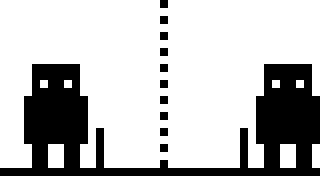
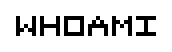
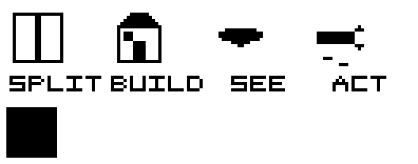
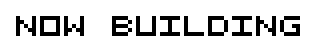
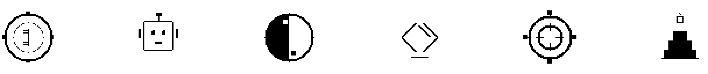

<!-- Se1faware · 自我觉察的工程师 -->

<table align="center">
  <tr>
    <td align="center" valign="middle">
      <pre>
█████  █████  .██..  █████  ..█..  █...█  ..█..  ████.  █████
█....  █....  █.█..  █....  .█.█.  █...█  .█.█.  █...█  █....
█████  ████.  ..█..  ████.  █████  █.█.█  █████  ████.  ████.
....█  █....  ..█..  █....  █...█  ██.██  █...█  █..█.  █....
█████  █████  █████  █....  █...█  █...█  █...█  █...█  █████
 
Stay aware · keep building
</pre>
    </td>
    <td align="center" valign="middle">
      <picture>
        <source media="(prefers-color-scheme: dark)" srcset="assets/hero-dark.gif">
        
      </picture>
    </td>
  </tr>
</table> 

A full-stack engineer becoming a Creative Engineer, tracking AI's frontier. 
I build where intelligence meets creativity. 
Code is my mirror, systems are my practice. 

 

  I treat engineering as a way of observing myself. 
   
  <b>Decompose</b> — Cut to the smallest actionable unit: abstraction is not simplification, it is cutting at the right seam. 
  <b>Build</b> — Patterns are others' crystallized trade-offs; judgment comes only from building. 
  <b>Perceive</b> — Systems are projections of thought: where the architecture ends, the thinking ends. 
  <b>Act</b> — Creation lives inside constraints: the work promises not perfection, but that it runs. 
   
  <picture>
    <source media="(prefers-color-scheme: dark)" srcset="assets/skills-dark.gif">
    
  </picture>
   
  <!-- <code>Decompose · Build · Perceive · Act</code> -->

 

- **DecisionCoach** — a decision trainer against over-analysis.
- **Agentic × 3D Creative Engineering** — Web3D, generative art, and pixel animation.
- **AI Agent × Chinese Metaphysics** — Four Pillars of Destiny and the I Ching — conversational and computable.

  <picture>
    <source media="(prefers-color-scheme: dark)" srcset="assets/dev-icons-dark.gif">
    
  </picture>

---

  <code>While I breathe, I create.</code> 
  <code>To see yourself is to begin building.</code> 
      <picture>
    <source media="(prefers-color-scheme: dark)" srcset="assets/heart-dark.gif">
    
  </picture>

